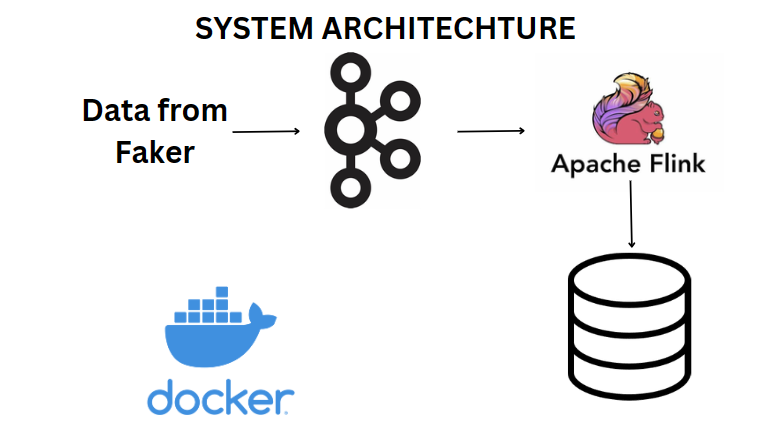

# Stream_Processing_Algorithm
The architechture of our system:

We are getting the data from Faker library. We are taking fake weather and random temperature in the range 10-110 degrees.

Then we are sending the data to apache kafka and then it is going to Apache Flink where we are processing it.

We are holding the data for 1 minute and then we are calculating the average temperature of the cities (if they are getting repeated) and then storing it in a table in postgres.

All the frameworks and postgres are used from docker after creating images.
